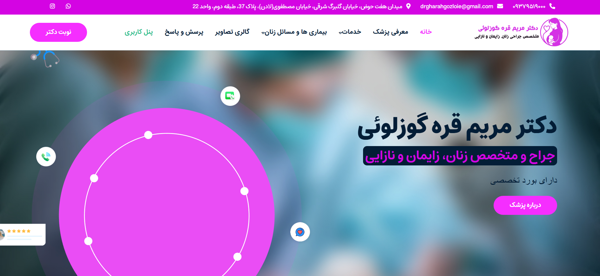
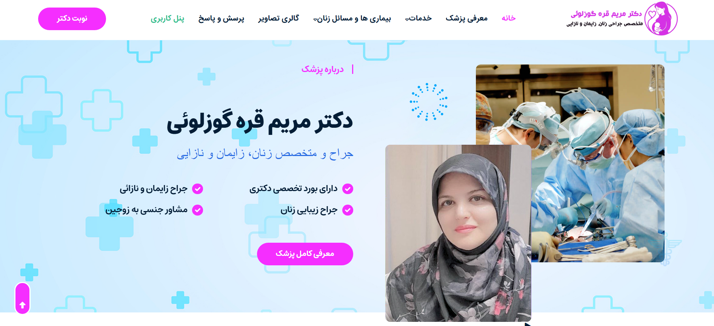
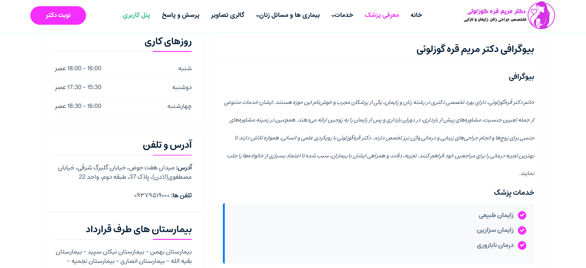

# Dr Reservation Project

A web platform for a gynecologist and infertility specialist. The site introduces the doctor, outlines medical services, and features a blog section with educational articles on women's health. An appointment reservation system is coming soon.

## 🚀 Features

- User registration and login
- User dashboard (profile management)
- Blog system with categorized medical articles
- Admin panel for content and user management
- Dockerized deployment
- Ready to deploy on VPS or any cloud environment

## 🛠 Tech Stack

- **Backend:** Django
- **Database:** PostgreSQL
- **Deployment:** Docker, Nginx

## 📷 Screenshots

### 🏠 Homepage


### 🏠 Homepage 2


### 🧑‍⚕️ Doctor Introduction


### 💊 Medical Services


### 👤 User Dashboard


## 📦 Deployment

This project is fully Dockerized and configured for production deployment.  
Run with:

```bash
docker-compose up --build
